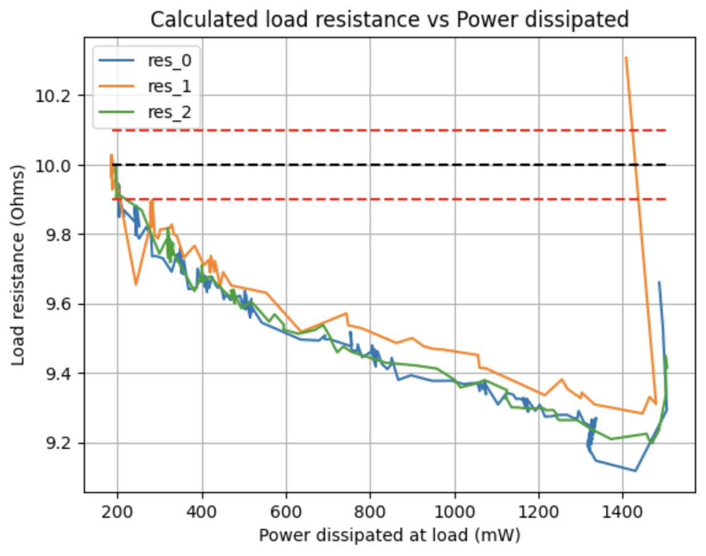
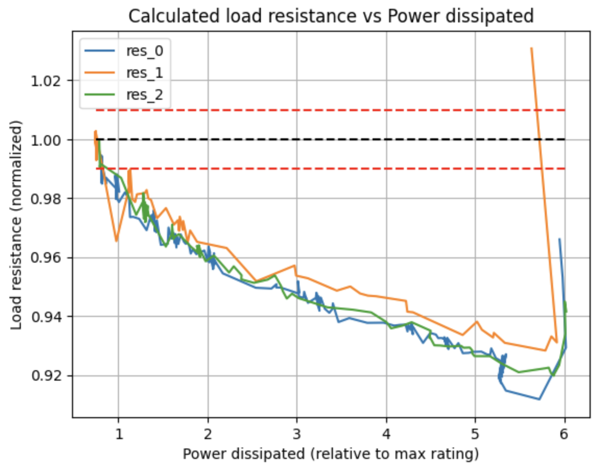
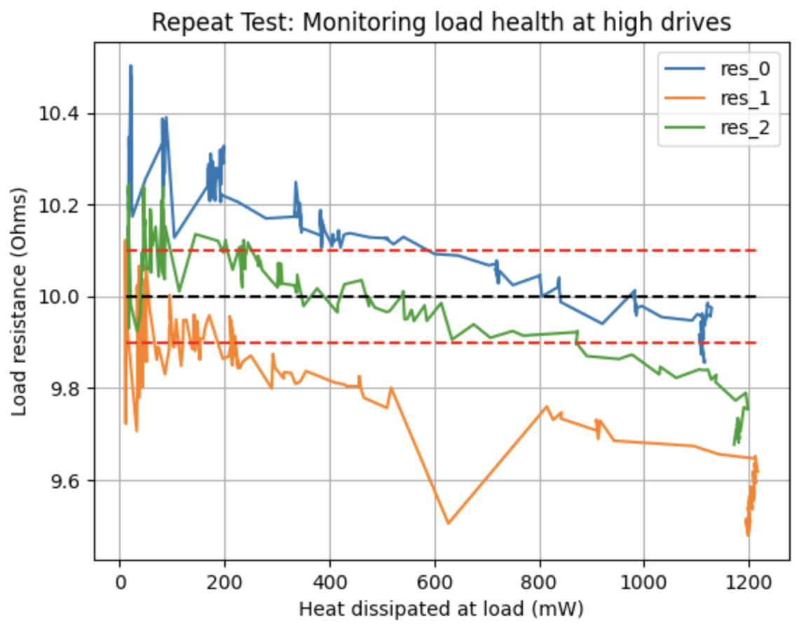
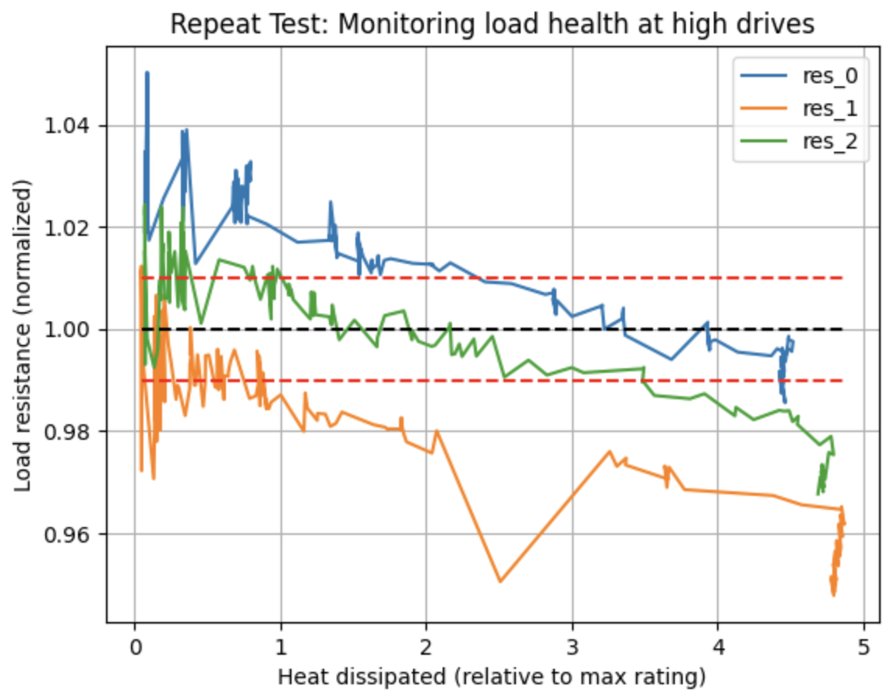

# Monitor health of resistance load using Raspberry Pi 

## Materials
- 1x Raspberry Pi 4 (or higher)
- 1x ADS1115 ADC
- 1x Chanzon 0.1 Ohm metal film resistor, 1% tolerance, power rating of 2 W
- 3x Cutequeen 10 Ohm metal film resistor, 1% tolerance, power rating of 0.25 W
- Breadboard and wires to construct the circuit

## Driving the load
The load is driven at different levels, and the load resistance is measured and compared to nominal values as an indicator of load health. 
To drive the load, either a current source or voltage source can be used. 

In the provided example, a DC power supply is operated in constant-current mode. Since the power supply does not have a programming interface, the current is adjusted manually, and the voltage drops across the current sense resistor and load resistor are measured using a Raspberry Pi 4 and an ADS1115 16-bit ADC. The load is a Cutequeen 10 Ohm metal film resistor with a rated tolerance of 1% and a power rating of 0.25 W. The current sense resistor is a Chanzon 0.1 Ohm metal film resistor with a rated tolerance of 1% and a power rating of 2 W.

## Calculating electrical current
Current is calculated by Ohm's Law using the measured voltage drop across the current sense resistor and the nominal resistance of that resistor. Unlike the load resistor, the current sense resistor is being operated at well below its max power rating (2W), so it is much more reliable for measuring current.

## Data collection
Using the script `src/monitor_adc.py` on the Raspberry Pi 4, the current sense voltage and load voltage are measured continuously via an ADC while the current drive is manually increased on the DC power supply. The script saves the results to CSV files containing info on timestamps, current sense voltage, load voltage, and current (calculated). The ADC gain and offset are determined empirically. 

I2C must be enabled on the Raspberry Pi in order for this script to work. 

## Post-processing
Once voltage and current are measured for multiple resistors, a separate script `src/plot_resistor_data.ipynb` is used to post-process and plot the data from multiple CSV files. Post-processing includes the following steps:

- Read all CSV files into separate DataFrame objects.
- Remove all rows after the first negative current value, which is an erroneous value that shows up when the ADC input voltage exceeds the max level supported by the ADC.
- Calculate nominal load voltage, load resistance, and power dissipation at the load. Add these as new columns to the DataFrame.

## Experiment 1 Results
The same script supports plotting the data with non-normalized or normalized axes. Multiple 10-Ohm resistors from the same package are studied. 

Note the sharp increase in resistance at the end. I believe that these are not real measurements, but erroneous values caused when the load voltage is above the max input level of the ADC. This is supported by the fact that the ADC produces non-sensical values (negative voltage values) soon after this resistance spike occurs.

At load powers at 1-5x max rating, resistor temperature increases significantly. The load is a metal film resistor, which has a small positive temperature coefficient. Also, given that metal film resistors have a temperature coefficient of 50 ppm, the change in resistance **due to temperature changes** should be negligible in this experiment. However, there is an apparent decrease in resistance as load power increases, suggesting another phenomenon is occurring.

## Experiment 1 Conclusion
Below are some possible reasons for the observed resistance decrease.

### Resistor breakdown 
A breakdown within the resistor element could lead to this deviation from nominal behavior. For example, high temperatures could cause carbonization and electrical shorts to form inside the resistive element, thus shortening the resistive path and decreasing resistance. 

Follow-up: Measure the resistance of the resistors used in this experiment at room temp. If they are significantly different from the starting resistances, then the resistors were likely permanent damaged during the experiment.

### ADC temperature sensitivity
The heat from the resistor conducts through the long copper leads and copper wires leading to the ADC input. The increase in temperature could affect the accuracy of the ADC itself. 

Follow-up: Check the ADC datasheet for temperature sensitivity information.

## Experiment 2 Results
The resistances of all three resistors were around 10-10.5 Ohms after Experiment 1, suggesting that no permanent degradation occurred. This warranted a repeat experiment to investigate further. 

Experiment 2 was conducted using the same setup and resistors from Experiment 1, though the ADS1115 ADC board was replaced. While Experiment 1 collects data starting from power levels near the load's power rating, Experiment 2 collects data from power levels as low as 0.2x the load's power rating. This allows me to see whether the loads behave differently at low power vs high power. 

Like Experiment 1, Experiment 2 shows a steady decrease in apparent load resistance at high powers. However, the data from Experiment 2 is notably noisier than that of Experiment 1, particularly at lower power. A new 10-Ohm resistor tested on the same setup shows similar noise levels (not plotted, see `src/res5_new.csv`), suggesting that this noise is not caused by degradation in the used resistors. This noise could be caused by thermal degradation within the experiment hardware. The experiment setup - which includes a plastic breadboard and thin wires - may be ill-suited for the elevated temperatures caused by the high electrical currents, as the breadboard had already been warped from high heat in previous experiments. Lastly, the ADS1115 ADC may be ill-suited for this type of experiment. All experiment data is acquired through the ADC. The ADC may not provide low enough noise levels to monitor the health of 1% tolerance resistors, or the ADC may be susceptible to higher noise levels at increase temperatures. 

## Experiment 2 Conclusion
It appears that the resistors were not permanently degraded in Experiment 1, given that their resistances start near 10 Ohms in Experiment 2. However, in this setup, it's impossible to conclude on (1) the degree of degradation in the resistors or (2) if the drop in load resistance at high powers is real.

The ADC noise and temperature sensitivity are not well understood, and since current and power are both calculated from ADC voltage measurements, all experiment data is highly sensitive to ADC noise. This must be investigated further, starting with the ADS1115 datasheet. Furthermore, given the observed damage to the breadboard, it's clear that this hardware setup is not ideal for high current draws. 

A better hardware setup for resistive load monitoring would include (1) a programmable DC power supply with built-in voltage and current monitoring, and (2) wires or PCB traces rated for current draws of over 1 Amp. 

## Next steps
- Evaluate ADC noise levels using the ADS1115 datasheet
- For better quality data, repeat experiment using a programmable DC power supply with built-in voltage and current monitoring
